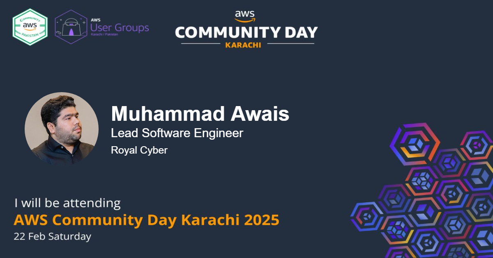

# social-media-event-attendee-banner-generator
This project is a web-based tool that allows users to create custom social media banners for Tech Events. Users can upload a headshot, enter their name, designation, and company, and generate a professional banner with a background graphic. The banner is optimized for sharing on platforms like LinkedIn and Instagram.

<!--  -->

# Cropper.js
https://github.com/fengyuanchen/cropperjs/blob/main/README.md

# JQuery Cropper
https://github.com/fengyuanchen/jquery-cropper